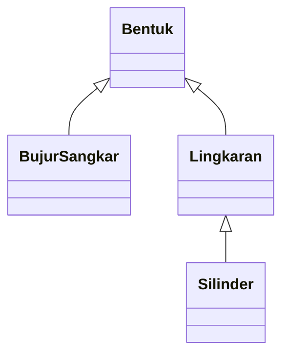

<div align="center">

# 📐 Program Bangun Datar & Bangun Ruang

**Implementasi Object-Oriented Programming (OOP) menggunakan Java**


</div>

---

## 👤 Identitas

| Keterangan | Isi |
|---|---|
| Nama | [ANAK AGUNG AYU INTAN PUTRI MAHARANI] |
| Kelas | [B] |
| NIM | [F1D02510037] |


## ✨ Tentang Program

Program ini merupakan latihan pemrograman berorientasi objek (**Object-Oriented Programming/OOP**) menggunakan Java. Program memodelkan tiga bentuk geometri, yaitu **bujur sangkar, lingkaran, dan silinder**. Setiap objek menyimpan informasi warna dan dapat menghitung luas atau volume sesuai jenis bentuknya.

## 🎯 Tujuan

- Memahami konsep **inheritance** (pewarisan kelas).
- Menerapkan **encapsulation** melalui atribut dan method getter/setter.
- Mempraktikkan **method overriding** untuk menampilkan informasi objek.
- Menghitung luas bujur sangkar, luas lingkaran, dan volume silinder.

## 🧩 Struktur Kelas



**Keterangan:** segitiga kosong mengarah ke kelas induk (*parent/superclass*). Jadi, `BujurSangkar` dan `Lingkaran` mewarisi `Bentuk`, sedangkan `Silinder` mewarisi `Lingkaran`.

| File | Peran |
|---|---|
| `Bentuk.java` | Kelas induk yang menyimpan warna dan menyediakan `printInfo()`. |
| `BujurSangkar.java` | Menghitung luas bujur sangkar. |
| `Lingkaran.java` | Menghitung luas lingkaran. |
| `Silinder.java` | Menghitung volume silinder dan saat ini juga berisi `main()`. |
| `main.java` | Berisi kode pengujian, tetapi pada file yang dikirim method `main()` belum dibungkus dalam deklarasi kelas. |

## 🏗️ Penjelasan Setiap Kelas

### 1. `Bentuk` — Kelas Induk
Kelas dasar (*superclass*) untuk bentuk geometri.

- `warna`: atribut `protected` yang dapat diakses kelas turunan.
- `Bentuk(String warna)`: konstruktor untuk mengatur warna.
- `getWarna()` dan `setWarna(String warna)`: mengambil dan mengubah warna.
- `printInfo()`: menampilkan informasi warna bentuk.

### 2. `BujurSangkar extends Bentuk`
Kelas turunan yang merepresentasikan bujur sangkar.

- Atribut: `sisi`.
- Konstruktor: `BujurSangkar(double sisi, String warna)`.
- Getter/setter: `getSisi()` dan `setSisi(double sisi)`.
- `hitungLuas()`: menghitung luas dengan rumus **sisi × sisi**.
- `printInfo()`: menampilkan warna dan luas bujur sangkar.

### 3. `Lingkaran extends Bentuk`
Kelas turunan yang merepresentasikan lingkaran.

- Atribut: `radius`.
- Konstanta: `PHI = 3.14`.
- Konstruktor: `Lingkaran(double radius, String warna)`.
- Getter/setter: `getRadius()` dan `setRadius(double r)`.
- `hitungLuas()`: menghitung luas dengan rumus **π × radius × radius**.
- `printInfo()`: menampilkan warna dan luas lingkaran.

### 4. `Silinder extends Lingkaran`
Kelas turunan dari `Lingkaran` yang merepresentasikan silinder/tabung.

- Atribut: `tinggi`.
- Konstruktor: `Silinder(double tinggi, double radius, String warna)`.
- Getter/setter: `getTinggi()` dan `setTinggi(double t)`.
- `hitungVolume()`: menghitung volume dengan rumus **luas alas × tinggi**.
- `printInfo()`: menampilkan warna dan volume silinder.

## 💡 Konsep OOP yang Digunakan

| Konsep | Penerapan dalam Program |
|---|---|
| **Inheritance** | `BujurSangkar` dan `Lingkaran` mewarisi `Bentuk`; `Silinder` mewarisi `Lingkaran`. |
| **Encapsulation** | Atribut `sisi`, `radius`, dan `tinggi` bersifat `private`, dengan akses melalui getter/setter. |
| **Method Overriding** | `printInfo()` ditulis ulang di kelas turunan agar informasi yang ditampilkan sesuai objek. |
| **Constructor** | Menginisialisasi nilai atribut saat objek dibuat. |

## 🧪 Contoh Pengujian

```java
BujurSangkar bs = new BujurSangkar(4.0, "Merah");
bs.printInfo();

Lingkaran lk = new Lingkaran(7.0, "Hijau");
lk.printInfo();

Silinder sil = new Silinder(10.0, 7.0, "Biru");
sil.printInfo();
```

## ▶️ Cara Menjalankan

Pastikan **Java Development Kit (JDK)** sudah terpasang. Simpan setiap kelas publik dalam file dengan nama yang sesuai.

Buka terminal pada folder proyek, lalu jalankan:

```bash
javac Bentuk.java BujurSangkar.java Lingkaran.java Silinder.java
java Silinder
```

> **Catatan:** `Silinder.java` saat ini memiliki method `main()`, sehingga dapat digunakan untuk menjalankan pengujian. File `main.java` yang dikirim berisi method `main()` saja tanpa deklarasi kelas. Jika ingin menggunakannya sebagai file utama terpisah, bungkus method tersebut di dalam kelas, misalnya `public class Main`, simpan sebagai `Main.java`, lalu jalankan `java Main`. Hindari menjalankan dua salinan pengujian yang sama.

## 📝 Catatan

- Program menggunakan tipe data `double` untuk ukuran dan hasil perhitungan.
- Program belum memvalidasi agar nilai sisi, radius, dan tinggi selalu positif.
- `Silinder` menggunakan luas alas yang diwarisi dari `Lingkaran`, kemudian mengalikannya dengan tinggi untuk menghitung volume.

## 📝 Contoh Output


---

<div align="center">

**📚 Dibuat untuk latihan pemrograman Java dan konsep OOP**

</div>
